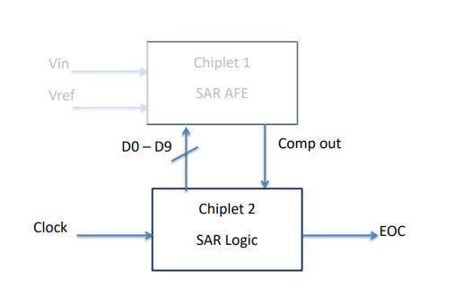

# Introduction
* The project aims to develop a 10-bit Successive 
Approximation Register (SAR) Analog-to-Digital Converter (ADC) with a 
100 MS/s sampling rate. This device is intended for high-speed signal 
processing applications, requiring meticulous design optimization to 
meet timing, power, and area specifications.
## Tools Used
* The scripts indicate the use of Synopsys tools and the 
SAED90nm technology library for design and analysis

